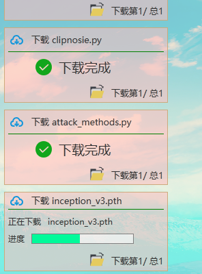

# Bshell
Bshell是一个简洁易用的人性化的ssh客户端和终端模拟器。

主要特性：
1. 多平台支持Windows,macOS,Linux.
2. 多标签,批量服务器管理.
3. 漂亮的平滑字体显示.
4. 终端,sftp同屏显示,同步切换目录.
5. 文件、文件夹默认下载、另存为、上传、拖拽上传.
6. 命令自动提示,智能匹配，一键自动补全,输入更快捷,方便.
7. sftp支持,通过各种优化技术,加载更快,切换,打开目录无需等待.
8. 服务器CPU、内存、显存等实时监控，再也不用nvidia-smi查看是否有足够显存了！
9. 命令输入框,支持自动补全,命令历史.
10. 自定义初始命令，再也不用连接后先cd xx在conda activate xx了.
11. 可设置终端背景图片,透明度自由调节.
## **界面展示**
### 1. 主界面

下面是个gif，可以点击播放

### 2. 文件相关操作

### 3. 侧边栏

####  下载

#### 4. 设置（开发中）

## **快捷键**

1. 所有界面 
①Ctrl+TAB：按顺序切换tab 
②Ctrl+W：关闭当前选中tab 
③Ctrl+N：打开一个新的标签页 
④双击Ctrl：在终端和命令输入行之间切换焦点（已连接） 
2. 新标签页 
a.账户列表： 
①Delete:删除当前选中账户 
3. 文件树： 
①Ctrl+C：复制当前选中文件 
②Ctrl+V：粘贴文件到当前选中文件夹 
②Ctrl+Shift+C：复制当前选中文件（夹）名到剪切板 
4. 终端命令区 
a.终端： 
①Ctrl+C：结束当前进程 
②Ctrl+D：退出当前进程 
③Ctrl+X：挂起当前进程 
④Ctrl+H：退格（即删除） 
④Ctrl+U：剪切光标处到行首的所有字符 
⑤其他... 
b.命令输入行： 
①TAB：补全当前选中历史命令搭配命令输入行 
②Ctrl+Backspace：清空当前命令输入行所有内容 
③Delete:删除当前选中历史命令 

## **模块化**
1. jsch不支持模块化，但是有简单迁移的替代方法：https://github.com/mwiede/jsch   
2. h2数据库：截止至2023年9月11日18:48:59不支持模块化：https://github.com/h2database/h2database/issues/1415   
3. eawtstub：不支持模块化，但是我fork了一份 https://github.com/Xiaobaishushu25/eawtstub，需要时可以自己模块化一下   
4. trove4j  
5. slf4j-log4j12  
6. jna：支持模块化

## **打赏或者贡献**

您可以通过下面的方法来贡献和支持该项目：
* 在 GitHub/Gitee 上为项目加注星标、给予反馈
* 提交PR
* 贡献您的想法建议
* 与您的同学朋友同事分享Bshell
* 如果您喜欢Bshell，可以考虑捐赠
